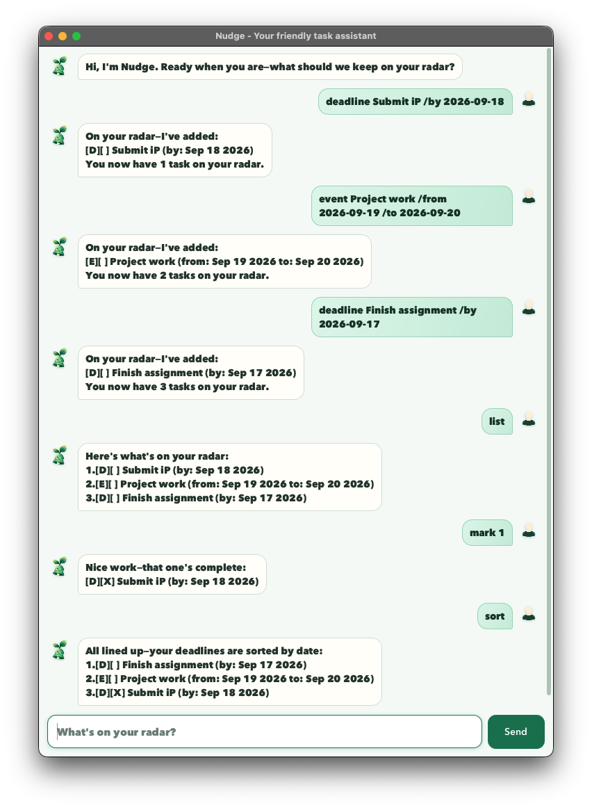

# Nudge User Guide



Nudge is a friendly task assistant that helps you keep track of todos, deadlines, and
events. Its concise, encouraging responses make it easy to stay organized.

## Quick start

Type a command into the message box, then press `Enter` or click **Send**. Enter command
words in lowercase and use dates in `yyyy-MM-dd` format, such as `2026-09-18`.

| Action | Command |
| --- | --- |
| Add a todo | `todo DESCRIPTION` |
| Add a deadline | `deadline DESCRIPTION /by DATE` |
| Add an event | `event DESCRIPTION /from START_DATE /to END_DATE` |
| Show all tasks | `list` |
| Find tasks | `find KEYWORD` |
| Sort deadlines | `sort` |
| Mark a task as complete | `mark NUMBER` |
| Mark a task as incomplete | `unmark NUMBER` |
| Delete a task | `delete NUMBER` |
| Exit Nudge | `bye` |

## Adding tasks

### Todos

Use `todo` for a task without a date:

```text
todo Review Week 6 notes
```

### Deadlines

Use `deadline` followed by `/by` and the due date:

```text
deadline Submit iP /by 2026-09-18
```

### Events

Use `event` with its start and end dates. The start date must be before the end date:

```text
event Project work /from 2026-09-19 /to 2026-09-20
```

Nudge saves changes automatically, so your tasks will still be available the next time
you start the application.

## Viewing and finding tasks

Use `list` to display every task and its number:

```text
list
```

Use `find` to display tasks whose descriptions contain a keyword:

```text
find Project
```

The search is case-sensitive and checks task descriptions only.

## Sorting deadlines

Use `sort` to arrange deadlines from the earliest due date to the latest:

```text
sort
```

Todos and events remain in their existing positions. Deadlines with the same due date
keep their relative order. The sorted order is saved and determines the task numbers
used by `mark`, `unmark`, and `delete`.

For example, this list:

```text
1.[D][ ] Submit iP (by: Sep 18 2026)
2.[E][ ] Project work (from: Sep 19 2026 to: Sep 20 2026)
3.[D][ ] Finish assignment (by: Sep 17 2026)
```

becomes:

```text
1.[D][ ] Finish assignment (by: Sep 17 2026)
2.[E][ ] Project work (from: Sep 19 2026 to: Sep 20 2026)
3.[D][ ] Submit iP (by: Sep 18 2026)
```

## Updating and deleting tasks

First use `list` to check the number of the task you want to update.

Mark task 1 as complete:

```text
mark 1
```

Mark it as incomplete again:

```text
unmark 1
```

Delete task 1:

```text
delete 1
```

After a task is deleted, Nudge renumbers the remaining tasks.

## Exiting Nudge

Use `bye` to close the application:

```text
bye
```
